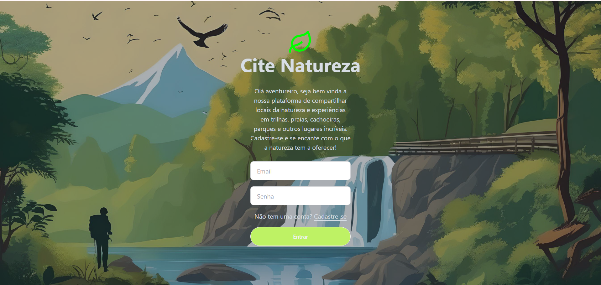
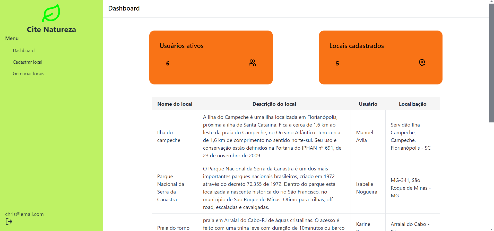

# Projeto - Natureza365 (Cite Natureza 🌱)
## Projeto Módulo 2 - Front-end FuturoDev

O Natureza365 (Cite Natureza) é uma plataforma que permite aos usuários explorar e contribuir para a preservação da natureza, fornecendo acesso a informações sobre áreas naturais, trilhas, parques ecológicos, reservas ambientais e outros locais de interesse para os amantes da natureza. 

## Problema que Resolve

O Cite Natureza resolve o problema de encontrar locais específicos de preservação ambiental com precisão. Além de fornecer a localidade do local desejado, o sistema usa coordenadas geográficas para garantir que os usuários possam encontrar a localização exata, facilitando o acesso, por conta de na maioria da vezes serem locais afastados. 

## Tecnologias utilizadas

- React com Vite: Utilizado para a construção da interface do usuário.
- JSON-Server: Usado como um mock server para persistência de dados durante o desenvolvimento.
- Leaflet: Biblioteca JavaScript de código aberto para mapas interativos.
- Axios: Utilizado para fazer requisições HTTP.
- React Hook Form: Utilizado para gerenciamento de formulários.
- React Router Dom: Para gerenciamento de rotas em projetos React, permitindo uma navegação mais fluida 
- Tailwind CSS: Usado para estilização com o DaisyUi.

## Design do Projeto 

  
  Tela de início/login 
  Tela de Dashboard

## Como rodar o projeto
    1. Clone o repositório:`git clone https://github.com/Geeobarros/natureza365-FE.git`  
    2. Instalar as dependencias:  `npm install`
    3. Instalar dependencias de desenvolvimento: `npm install --dev`
    4. Rodar o servidor de desenvolvimento: `npm run dev`
    5. Rodar o servidor Json-Server: `npx json-server db.json`

##  Melhorias que podem ser aplicadas

* Funcionalidades de Busca: Adicionar filtros e funcionalidades de busca para encontrar locais de forma mais eficiente.
* Possibilidade de adicionar imagens.
* Poder visualizar data/hora na qual adicionou o local.
* Possiblitar compartilhamento em outras plataformas
* Espaço para usuários compartilharem as experiências como dificuldade de chegar, perigos que possa ter na região, dicas de melhorias;
* Parceria com guias (para se ter melhor entendimento e locomoção)
* Habilitar outras línguas para estrageiros poderem também ter um melhor acesso 
* Dicas para se ter dicas de preservação e conscientização de cuidados com o meio ambiente e os animais que lá vivem(principalmente para evitar lixos, má interação e alimentação irregular com animais silvestres).
* Melhorar a responsividade e usabilidade em dispositivos móveis.

## [Autor(a)](autor)

 Feito por: Geovanna Barros

